
<h1 align="center">基于JEE开发的猎头公司管理系统+vue</h1>

## 简介
猎头公司管理系统：角色分为管理员、部门负责人、财务人员、普通员工；功能包括个人中心、招聘管理、薪资管理、通知管理、业务管理、信息录入与编辑、查询筛选等模块。    --计算机毕业设计源码；毕设源码；java毕业设计源码

## 联系方式

<h3 align="center">获取完整代码与数据库文件 + 微信：deepguan QQ: 86050149 QQ群: 783742310</h3>

<h3 align="center">可帮忙远程部署 包运行成功！提供远程部署、修改代码、设计文档指导、代码讲解等服务！</h3>

## 功能介绍（完整见运行截图）
管理员：管理员可以通过登录界面访问管理系统，并进行多角色切换。在系统中，管理员拥有对部门管理、招聘管理、薪资管理等功能模块的访问权限。管理员能够添加、修改和删除系统内的部门信息、岗位设置、奖惩信息及财务人员的管理。同时，管理员还可以查看和编辑员工的基本信息，包括人员姓名、联系方式、职位信息等，方便管理组织结构和人事变动。此外，管理员有权限修改系统通知信息，通过修改、删除、查看等操作，确保通知的有效性。管理员还可查看业务管理模块，帮助维护客户信息和业务往来记录。

部门负责人：部门负责人在系统中可以管理所在部门员工的信息，查看和编辑员工的联系方式、职位、入职时间等信息，并对普通员工的日常工作进行安排和监督。部门负责人具备新增、修改和删除部门内部通知信息的权限，并能对部门内的任务进展和员工绩效进行跟踪评价。部门负责人还可以访问招聘信息管理模块，配合整体团队招聘需求进行人员招募和配置，确保部门结构合理、岗位职责明确。

财务人员：财务人员能够访问财务管理模块，对员工的薪资、补贴和奖金信息进行记录和核算，确保准确发放。同时，财务人员可通过查询和筛选功能，查看各类财务报表和薪资记录，并对历史财务数据进行调整和记录。此外，财务人员还承担财务数据的保密工作，并负责与其他部门沟通协调，确保公司财务运作正常高效。

普通员工：普通员工登录系统后，可访问个人中心查看和更新自己的基本信息，包括联系方式、身份证号和职位信息等。员工能查看自己的通知信息，通过通知信息管理模块获取公司公告和通知内容。员工还可使用系统上传和更新个人头像，为个人资料完善提供便利。在业务管理模块中，普通员工可以跟踪自身的业务进展，了解服务公司信息等，并通过系统完成规定的业务操作。普通员工在系统中也可提交个人工作需求，确保公司内信息传递的畅通。

## 运行截图
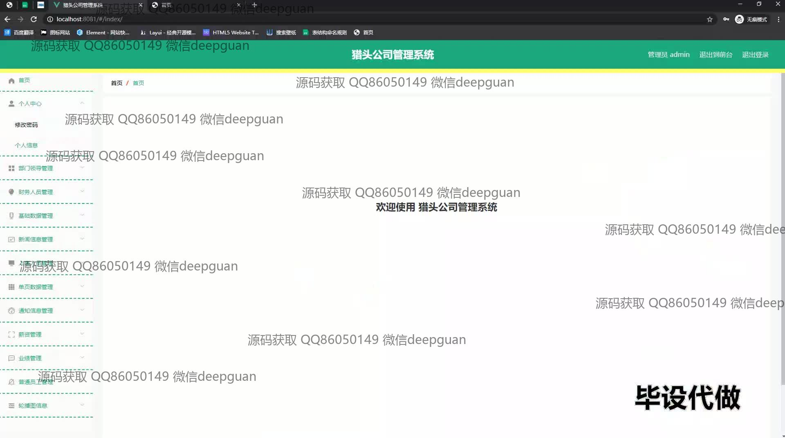
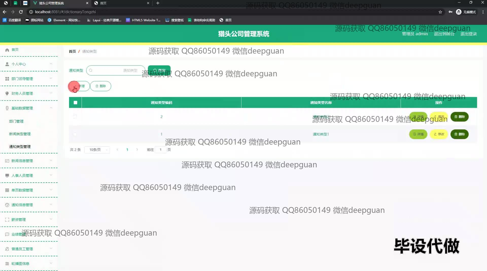
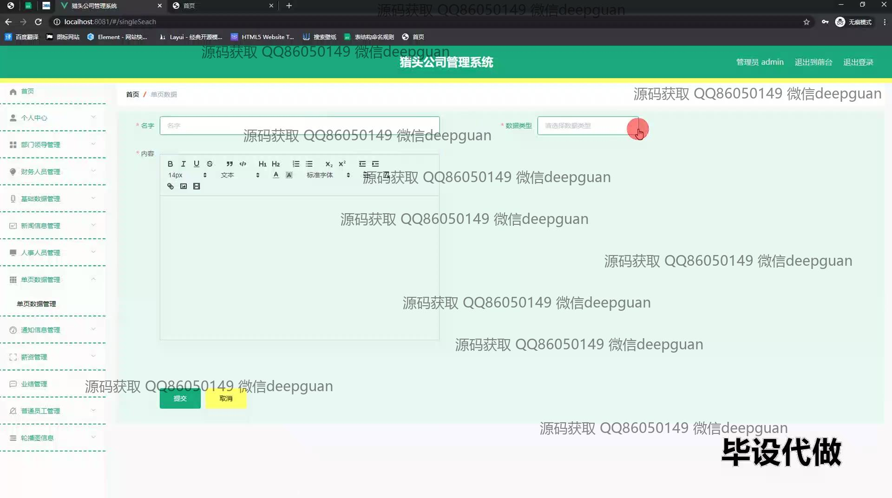
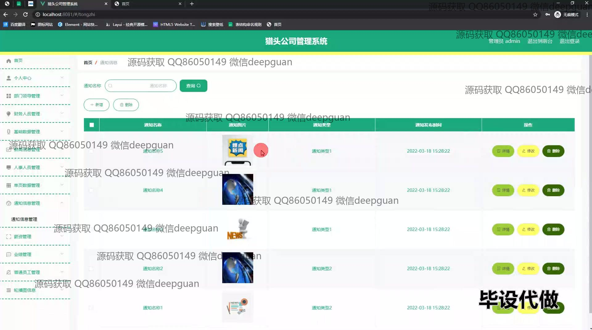

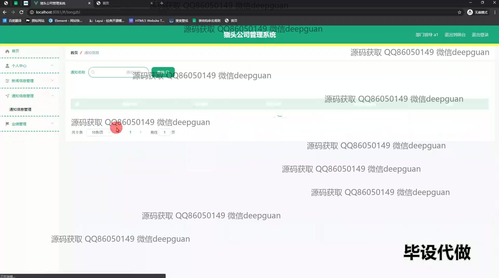
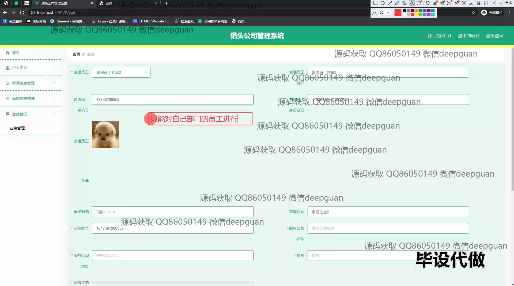
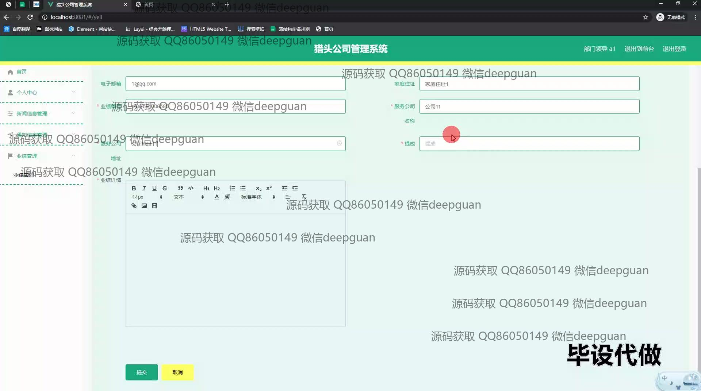

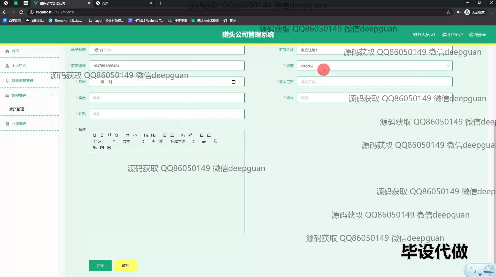
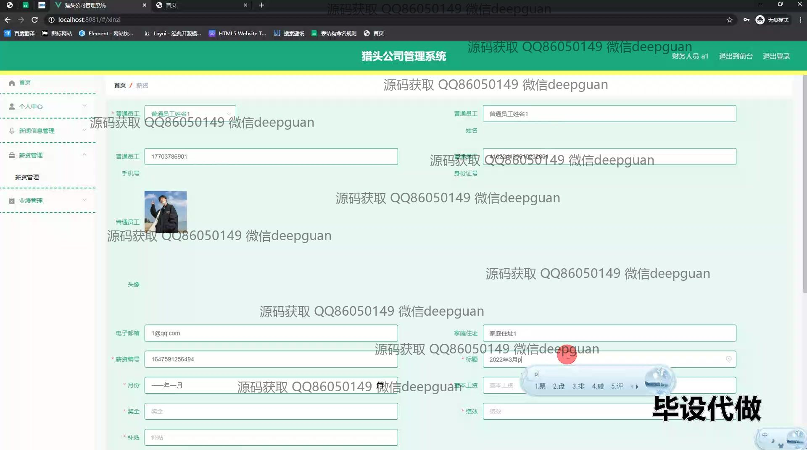
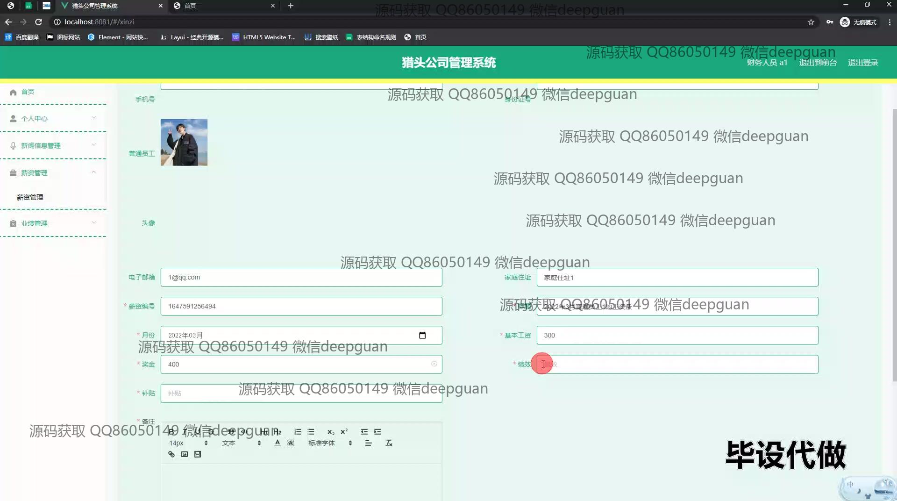
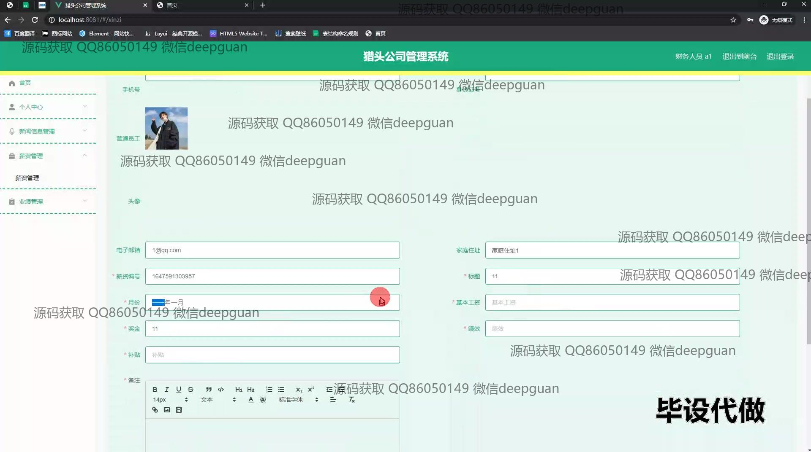
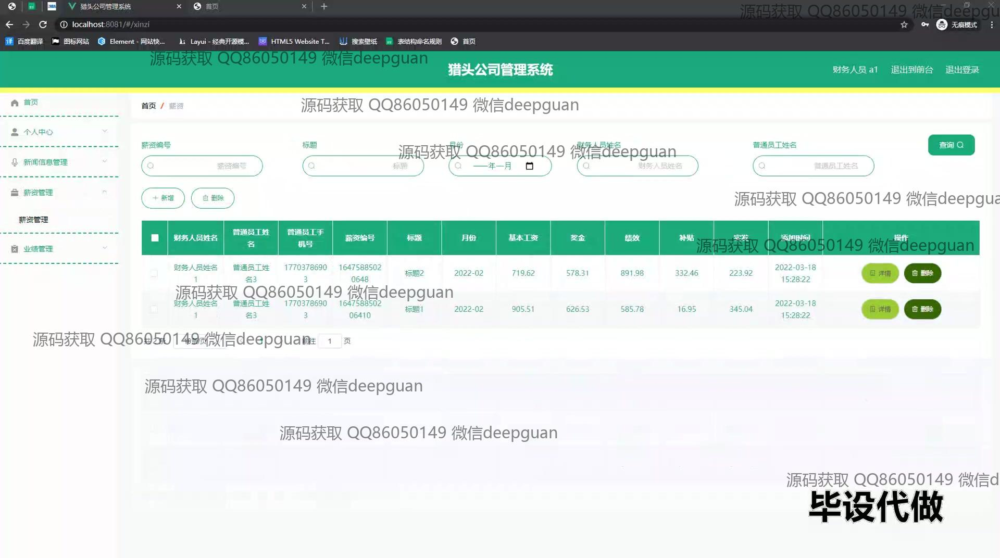
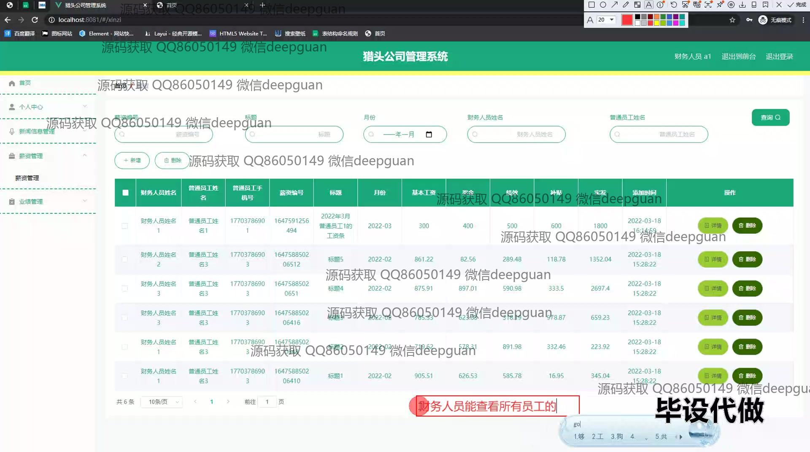
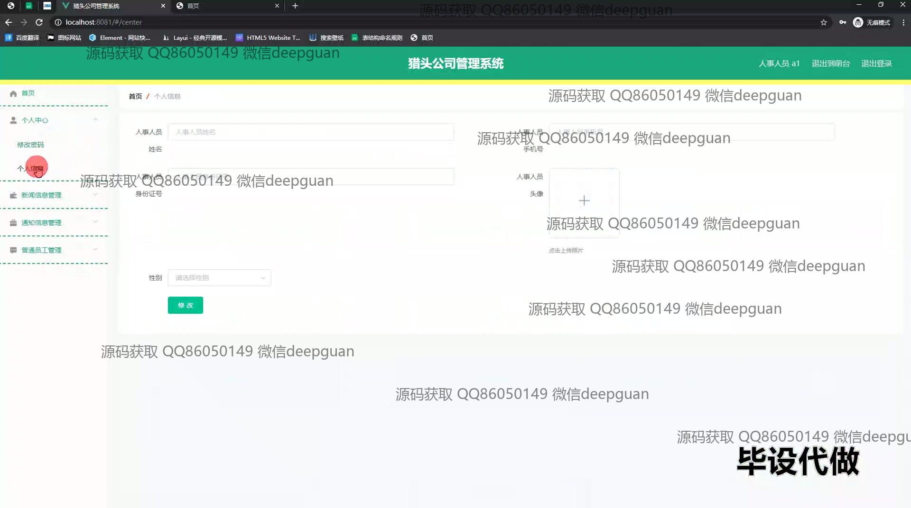
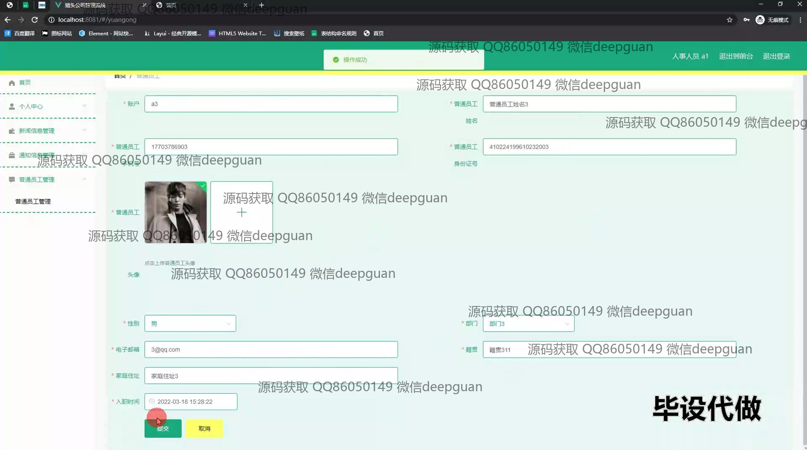
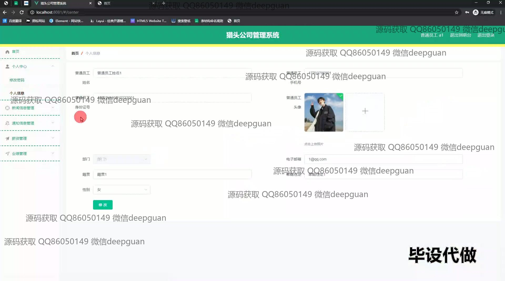
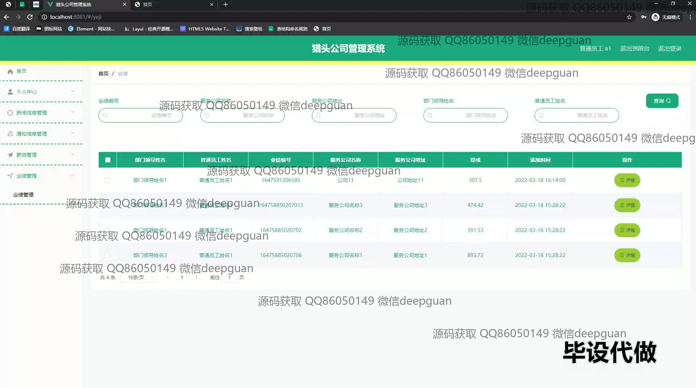

本代码来源于网络,仅供学习参考使用!

